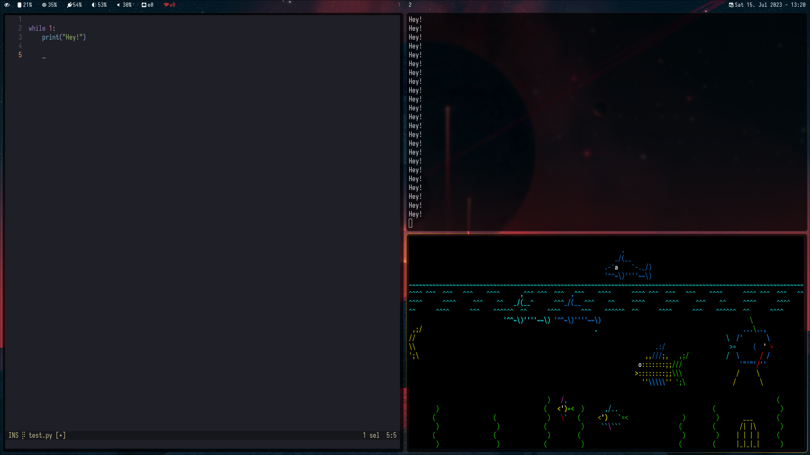

### If you're not on <https://git.kroner.dev/kreny/dotfiles>, then you're on a mirror.

# dotfiles

## Prerequisities:

- `git`
- `stow`

## Installation:

- `git clone https://github.com/krenyy/dotfiles ~/.dotfiles`
- `cd ~/.dotfiles`
- `./install.sh`
